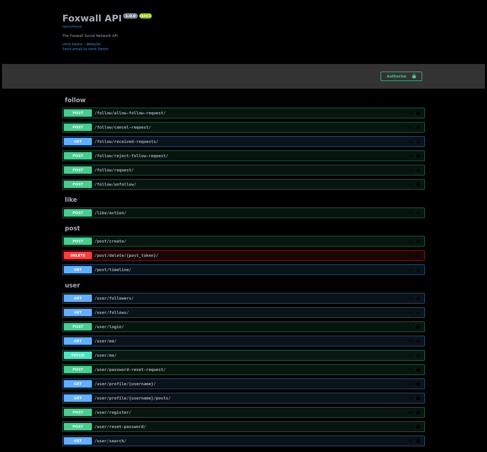
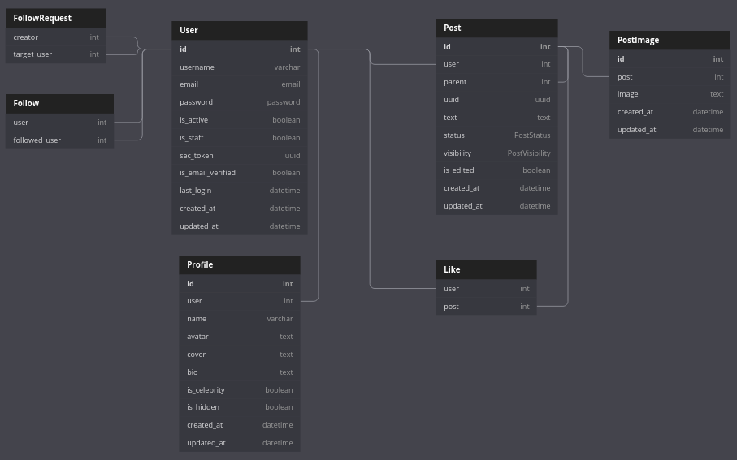

# FoxWall

Foxwall is a basic social media api service written with python/django. It's completely open source. Feel free to fork. Also you can contribute. Just create pull request.

## Image From API
&emsp;

I used [drf-spectacular](https://github.com/tfranzel/drf-spectacular) for Open API 3.0

&emsp;

## How To Use

### Prerequisites

Currently python and any virtual environment package must be in your system. I'm saying currently because this project will have docker option.

&emsp;
### Using Foxwall

1. Clone this repository.
2. Create virtual environment and install packages from requirements.txt file.
4. Execute `python manage.py migrate` for migrating models to database.
5. Execute `python manage.py runserver`. And that's it! Now you are able to use Foxwall API. For that just go to [localhost:8000](http://127.0.0.1:8000)

&emsp;

### Testing

I used pytest for unit testing and e2e testing.

### Trying the tests
Execute `pytest` for testing the app.
For the test coverage please execute `pytest --cov` or `pytest --cov --cov-report=html` if you want html report.

&emsp;

## Database Diagram

How i coded models? Firstly i decided to think about db. For this purpose i created diagram below (with [Db Diagram](https://dbdiagram.io)). That diagram helped a lot. I suggest to create database diagram whenever you start to a backend project.

## Not done yet...

- [ ] Docker configurations.
- [ ] Leave a post as comment to the post.
- [ ] Currently there are fields that i did not use such as last_edited field on post model. Should make meaningful these fields.
- [ ] Fix bio issue after registiration
- [ ] Create views for followers & follows list
