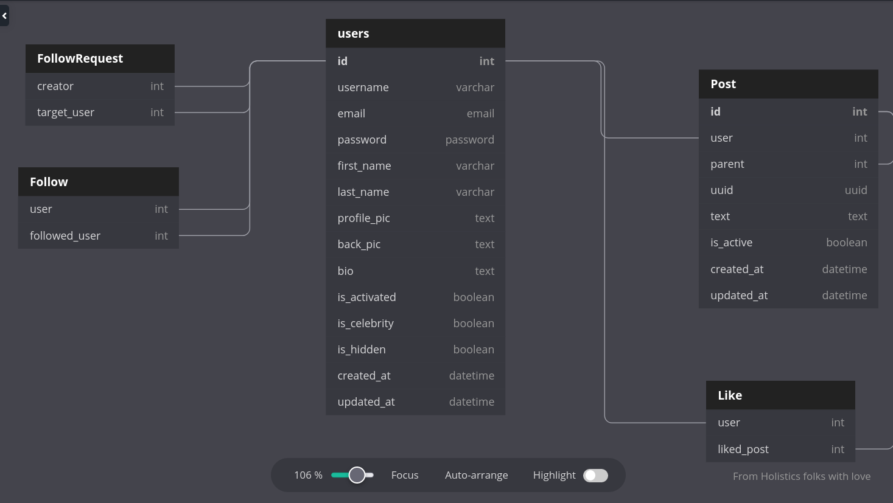

# FoxWall

A personal project like twitter which is written with django and react for improving my skills.

## Database Diagram

> This diagram is currently wrong. It must be change....

How i coded models? Firstly i decided to think about db. For this purpose i created diagram below (with [Db Diagram](https://dbdiagram.io)). That diagram helped a lot. I suggest to create database diagram whenever you start to a backend project.

